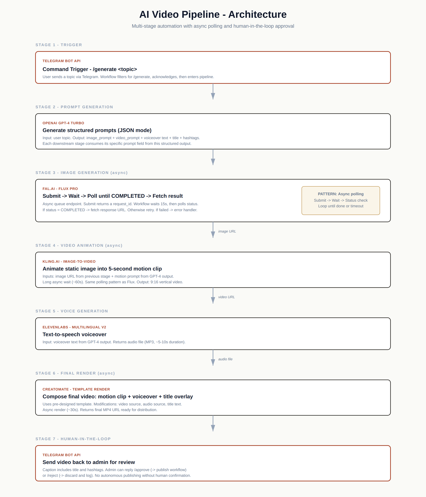

# AI Video Pipeline — Architecture Notes

> Architectural breakdown of a multi-stage AI video generation system: n8n orchestration, async API polling, and Telegram-based human-in-the-loop control.

This repository documents the **architecture** of a personal R&D project I built to explore multi-API AI orchestration. The goal was to take a single text prompt and produce a finished short-form video, with quality review built into the loop.

This is documentation only — no source code is published here.

---

## The pipeline



---

## Why this is interesting (architecturally)

On the surface this looks like "chain a few APIs together." It is not. The real complexity is:

**1. Five different async patterns.**
GPT-4 returns synchronously. Fal.ai and Kling return a queue ID and require polling. ElevenLabs streams a file. Creatomate returns a render ID. Each one has a different response shape, a different way of signaling completion, and a different failure mode. The orchestration layer has to normalize all of this.

**2. State threading across stages.**
The image_prompt produced by GPT-4 has to reach Fal.ai. The image URL Fal.ai returns has to reach Kling along with the motion prompt (also from GPT-4). The voiceover text reaches ElevenLabs. The Kling output and ElevenLabs output both feed Creatomate. n8n expressions like `$('Node Name').item.json.field` make this explicit and traceable.

**3. Polling without blocking.**
Naive implementation: submit, sleep 60 seconds, fetch. Reality: the API might be done in 8 seconds or might take 90. The pipeline uses bounded polling with an initial wait sized to typical response time, then status checks, then either fetch-result or retry.

**4. Failure is the default.**
Any stage can fail. Quota exceeded, content filter triggered, queue timeout, malformed response. Every stage has an error branch that routes back to the Telegram bot with a clear message about which stage failed and why.

**5. Humans are slow but necessary.**
The pipeline does not auto-publish. The final video goes to a Telegram chat for human review. The reviewer types `/approve` or `/reject`. This is the difference between a demo and a production system you'd actually let touch a public account.

---

## Stage breakdown

### Stage 1 — Telegram trigger

The entry point is a Telegram bot listening for `/generate <topic>`. The trigger filters on command prefix, replies with an acknowledgement (so the user knows the pipeline started), and passes the topic into the rest of the workflow.

### Stage 2 — Structured prompt generation (GPT-4)

A single GPT-4 call generates *all* downstream prompts at once, in JSON mode. One model call instead of five means lower latency, lower cost, and tighter creative coherence (the image, motion, and voiceover all reference the same underlying concept).

Output shape:

```
{
  "image_prompt":  "...",
  "video_prompt":  "...",
  "voiceover":     "...",
  "title":         "...",
  "hashtags":      "..."
}
```

### Stage 3 — Image generation (Fal.ai Flux)

The image_prompt goes to Fal.ai Flux Pro. This is a queue endpoint — submit returns a request_id and a status URL. The pipeline waits a fixed interval (sized to the median response time, ~15s), then polls status. If COMPLETED, fetch the response URL to get the image. If still processing, wait and retry. If FAILED, route to the error branch.

This is the polling pattern that gets reused for Kling and Creatomate. Once you have it working for one async API, the others are variations on the same shape.

### Stage 4 — Video animation (Kling.ai)

Kling takes the image URL from Stage 3 plus the video_prompt from Stage 2 and produces a 5-second motion clip in 9:16 vertical format. This is the slowest stage (~60s). Same polling pattern as Stage 3 but with longer initial wait.

### Stage 5 — Voice generation (ElevenLabs)

ElevenLabs is synchronous and the fastest external API in the pipeline. Send text, get audio file back. Multilingual v2 model handles non-English content if the topic happens to be in another language.

### Stage 6 — Final composition (Creatomate)

A Creatomate template defines the visual layout (video position, title text position, audio overlay). The render call modifies three fields: video source URL (from Kling), audio source URL (from ElevenLabs), title text (from GPT-4). Template-based rendering means consistent branding across every output without rebuilding the composition logic for each video.

### Stage 7 — Human-in-the-loop review

The final MP4 URL is sent back to Telegram with the title and hashtags as caption. The reviewer can `/approve` (which would trigger a publishing sub-workflow) or `/reject` (which logs the run and discards the output).

**This is the most important stage** even though it has no AI in it. Without a review gate, you have a content firehose with no quality control. With it, you have a useful assistant.

---

## Production hardening (not shown in the public architecture)

The diagram shows the happy-path skeleton. Running this for real adds layers I haven't published:

- **Rate limiting per Telegram user** — single user can't drain GPT-4 quota in a minute
- **Exponential backoff retries** on transient failures (HTTP 5xx, rate-limit responses)
- **Cost tracking** — every run logs estimated token/credit usage per provider, accumulated daily
- **Stuck-job detection** — a parallel watchdog workflow cleans up runs that exceed maximum allowed pipeline time (~5 minutes total)
- **Approval-side workflows** — `/approve` and `/reject` are themselves entry points to separate workflows that handle publishing or archival

These are the difference between "I built this once" and "this runs every day."

---

## What I learned

1. **One LLM call beats five.** Generating all prompts in a single GPT-4 call (with JSON output) is dramatically better than calling it per-stage.
2. **Async polling is a pattern, not a one-off.** Once you have the submit-wait-poll-fetch shape working, every queue-based API drops into it.
3. **Error messages should name the stage.** "Pipeline failed" is useless. "Stage 4 (Kling) failed: quota exceeded" tells you exactly what to do.
4. **Human approval is non-negotiable for content systems.** Even if the output is 95% good, the 5% can be reputationally catastrophic.
5. **n8n is a real orchestrator.** I went in expecting to outgrow it within weeks. I didn't. The expression system, error handling, and webhook support cover everything I needed.

---

## Why no source code

This is a personal R&D project, not a productized template. Publishing the workflow JSON would invite anyone to import it and report "it doesn't work" — which is fair, because the credentials, API versions, and Creatomate template are all environment-specific. The architecture is the transferable asset; the implementation is not.

If you want to discuss the implementation in depth, contact me directly.

---

## Tech stack

| Layer | Tool |
|-------|------|
| Orchestration | n8n (self-hosted on Linux VPS) |
| LLM | OpenAI GPT-4 Turbo |
| Image generation | Fal.ai Flux Pro |
| Video animation | Kling.ai v1 |
| Voiceover | ElevenLabs Multilingual v2 |
| Final render | Creatomate template engine |
| Control surface | Telegram Bot API |

---

## Author

**Hamidreza Abolhassani**
Full-stack developer — AI Automation & SaaS
Email: hr.dev.abolhassani@gmail.com
